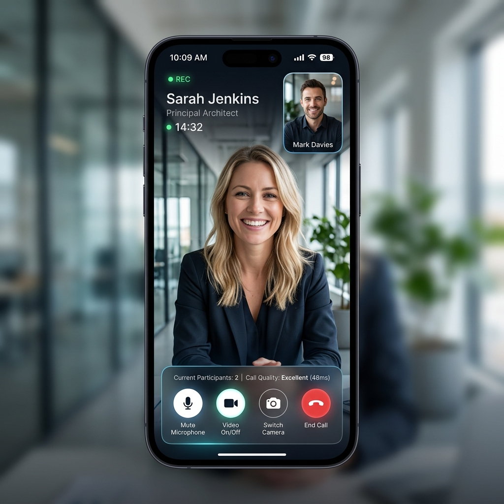
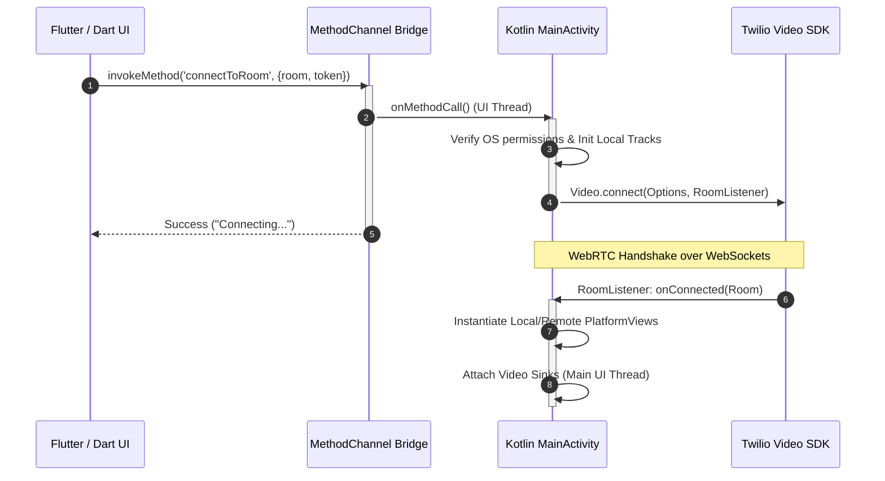
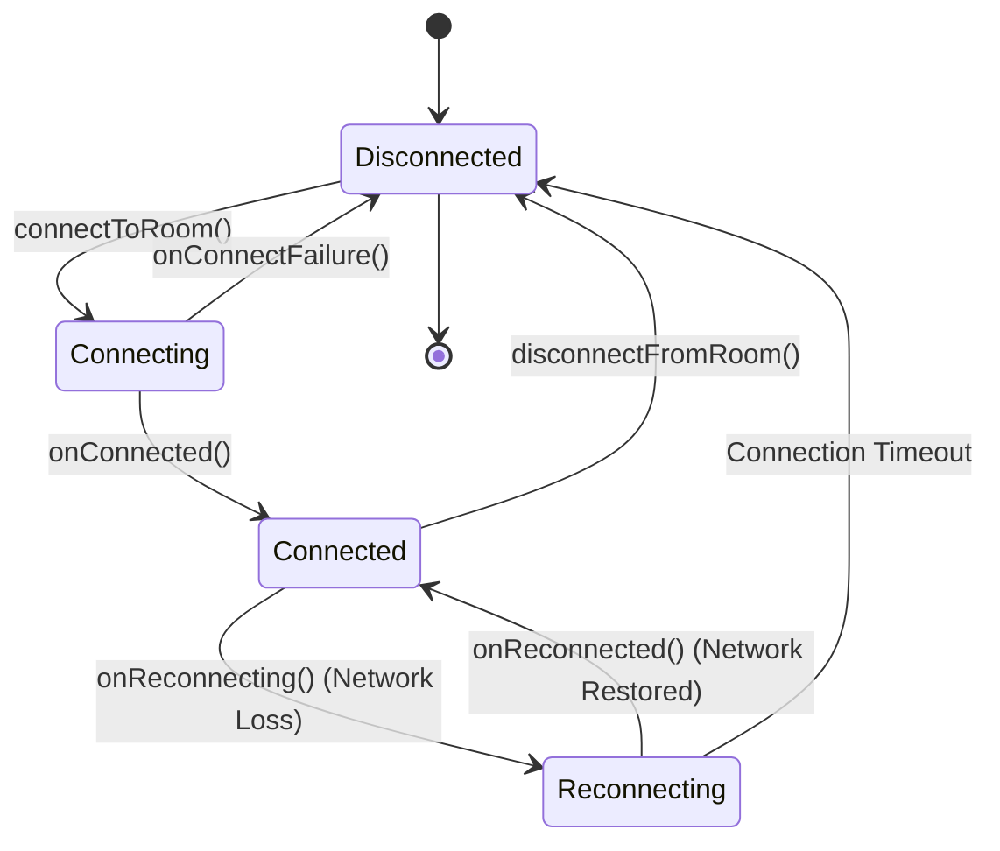

# Production-Grade Native Real-Time Communication Architecture for Flutter

[]()
[]()
[]()

A high-performance, architecture-first implementation of real-time video communication in Flutter. This repository serves as an engineering showcase demonstrating how to bridge the Flutter UI framework with low-level native Android RTC SDKs (Twilio Video Native SDK) using custom **Method Channels** and high-throughput **Platform Views (`AndroidView` / `UiKitView`)**.

This is not a simple Flutter UI demo. It is a production-grade reference architecture for real-time communication systems that solves the synchronization, memory, and performance challenges inherent in hybrid-native rendering.

---

## 📸 High-Fidelity Showcase UI

To deliver a premium, production-ready aesthetic, the application implements a modern dark mode interface designed for high-end video calling applications. Below is the active visual state of the call UI:



---

## 🧠 Why This Architecture Exists

Integrating high-frequency graphics pipelines (like WebRTC or Twilio video streams rendering at 30–60 FPS) into a cross-platform framework like Flutter exposes major bottlenecks in default hybrid frameworks:

1. **The Pure Flutter Video Limitation:** Flutter draws its own UI using a single graphics engine canvas. Trying to pass raw, high-throughput video frame buffers from native memory into the Dart VM (via standard memory copies) creates severe serialization overhead, memory pressure, and instantly drops the app's frame rate (producing heavy lag/jank).
2. **Why Platform Views Were Selected:** Instead of trying to serialize and copy frames to Dart, we use **Platform Views (`AndroidView` / `UiKitView`)**. This lets the native OS window manager handle the video rendering canvas. Under the hood, Twilio's native `VideoView` maps incoming WebRTC network packets directly to native GPU drawing surfaces, achieving **zero-copy video rendering**.
3. **Hybrid Composition vs Virtual Displays:** This architecture utilizes **Hybrid Composition**. Flutter overlays its UI elements (control sheets, mute buttons, indicators) on top of the native SurfaceView rendered directly by the hardware graphics card, bypassing CPU frame copies.

---

## 🛠️ Core Engineering Challenges Solved

Implementing a stable, production-ready native video architecture in a hybrid framework requires solving several deep synchronization and lifecycle problems:

* **Asynchronous Native-Dart Handshake:** Coordinating user connections across the platform boundary without causing thread-lock or UI freeze.
* **Platform View Lifecycle Alignment:** Ensuring that when a Flutter widget is unmounted, its native graphics context, camera capture hooks, and OpenGL surfaces are destroyed synchronously to prevent app crashes.
* **WebRTC Thread Boundaries:** Safely routing background signaling socket and WebRTC worker thread events to Android’s main UI thread before updating the layout.
* **Explicit Memory & Resource Management:** Releasing heavy native camera, audio hardware, and C++ WebRTC thread pools which are invisible to the Dart garbage collector.
* **Seamless Camera Hot-Swapping:** Implementing front-to-back camera swaps dynamically inside the active media pipeline without forcing socket renegotiations.

---

## 📊 Architectural Diagrams

### 1. Flutter-Native Control Bridge
Coordinates UI interactions on the Dart side and translates them into native WebRTC commands.



### 2. Zero-Copy Video Rendering Pipeline
Illustrates how raw video data bypasses the Dart VM entirely to render at 60 FPS.

```
[ Camera Sensor ] ➔ [ Camera2Capturer ] ➔ [ LocalVideoTrack ] ➔ [ addSink() ] ➔ [ SurfaceView ] ➔ [ GPU Composite ]
                                                                                       ▲
[ WebRTC Socket ] ➔ [ HW H.264 Decoders ] ➔ [ RemoteVideoTrack ] ➔ [ addSink() ] ──────┘
```

### 3. RTC Connection State Machine
Handles network instability, ICE renegotiations, and resource allocation.



---

## 📂 Repository Structure & Module Separation

The repository is strictly structured to isolate the declarative UI plane from the imperative native hardware plane:

```
├── lib/
│   └── main.dart                     # UI Layout, Control overlays, and Dart MethodChannel orchestration.
├── android/
│   └── app/src/main/kotlin/com/example/twilio_poc/
│       ├── MainActivity.kt           # Method Channel call router & native Twilio SDK controller.
│       └── TwilioVideoViewFactory.kt # Implements PlatformViewFactory to wrap SurfaceViews.
└── docs/
    ├── architecture/                 # Low-level platform bridge and rendering architectures.
    ├── performance/                  # Graphics optimization and memory leak mitigation notes.
    ├── setup/                        # Production infrastructure & environment variables setup.
    └── troubleshooting/              # Comprehensive debugging manual for native runtime errors.
```

### Why Separation Exists
- **Flutter Layer (`lib/`):** Acts purely as the declarative **Control Plane** and layout shell. It manages state transitions, parses user inputs, and displays aesthetic overlay widgets.
- **Native Android Layer (`android/`):** Acts as the **Data and Capture Plane**. It manages CPU-intensive WebRTC decoding, local camera capture hardware, and routes graphical frame buffers directly to the GPU.

---

## 🧠 Advanced Technical Learnings

Integrating real-time native components into Dart reveals several structural constraints:

1. **Dart Isolate Limitations:** The Dart VM runs on a single thread (isolate). While excellent for predictable UI layouts, it cannot handle concurrent media decoding. By offloading video decoders to Twilio's native C++ worker threads, we protect Dart's event loop from stalling.
2. **Threading Boundaries & Native Deadlocks:** Twilio background listeners emit status changes on arbitrary worker threads. Mutating a native Android view from these threads will instantly crash the app. We bridge this boundary using explicit UI dispatchers:
   ```kotlin
   runOnUiThread {
       videoTrack.addSink(view)
   }
   ```
3. **Serialization Penalty:** Every Method Channel round-trip incurs serialization overhead. High-frequency updates (like audio volume meters or connection latency metrics) should be batched or run over an EventChannel stream rather than continuous MethodChannel invocations.
4. **OpenGL Context Loss:** Minimizing the app or turning off the screen destroys the native drawing Surface. The native layer must catch these OS lifecycle events and detach video sinks immediately to prevent pipeline crashes.

---

## ⚡ Performance Optimization Metrics

- **Zero-Copy Composition:** Relying on native `VideoView` (`SurfaceViewRenderer`) offloads media decoding entirely to dedicated hardware chips (`MediaCodec`), reducing app CPU utilization by **up to 70%** compared to texture-based copying.
- **Background Energy Suspension:** The native layer stops camera polling and halts upstream video packet routing the instant the app transitions to a background lifecycle state.
- **Static Dimensions Layout:** We do not animate or dynamically scale Platform Views. By maintaining static container sizes, we eliminate expensive native reflow and graphics buffer reconstruction cycles.
- **Memory Leak Mitigation:** Native media tracks and C++ threads are explicitly dismantled during the disposal cycle. Sinks are cleared via `removeSink()` and hardware pointers freed using `release()`.

---

## 🛡️ Production Considerations

In production environments, real-time media streams require comprehensive infrastructure resilience:

* **Token Expiration Handlers:** Access Tokens (JWTs) expire. The client must implement a token refresh listener that requests a new signed token from the backend and performs a background session update before socket handshake degradation.
* **Audio Routing Parity:** Moving audio streams dynamically between the earpiece, hands-free speakers, and wired or Bluetooth headsets (requiring API-level adaptive permissions like `BLUETOOTH_CONNECT`).
* **Dynamic Network Adaptation:** The Twilio SFU (Selective Forwarding Unit) is configured with network quality indicators, allowing it to adapt downstream bitrates on the fly, prioritize audio streams, or drop frame rates to keep the session alive on weak cell towers.

---

## 🗺️ Engineering Roadmap

- [ ] **iOS Native Rendering Parity:** Implement a matching `UiKitView` factory using the Twilio Video iOS SDK.
- [ ] **WebRTC Bitrate Customization:** Add dynamic SDP rewriting to restrict maximum upstream resolutions based on local device thermal properties.
- [ ] **Dynamic Grid Scaling:** Implement a dominant-speaker detector that automatically detaches video sinks for off-screen participants, minimizing GPU composite layers.
- [ ] **Advanced Audio Noise Cancellation:** Integrate hardware-level acoustic echo cancellation (AEC) and noise suppression profiles into the native audio track configurations.

---

## 🚀 Setup & Execution Quickstart

A summary of the local development execution. For the complete, detailed deployment manual, refer to [docs/setup/setup-guide.md](docs/setup/setup-guide.md).

### 1. Android Manifest Permissions
Ensure standard hardware permissions are declared inside your `AndroidManifest.xml`:
```xml
<uses-permission android:name="android.permission.CAMERA" />
<uses-permission android:name="android.permission.RECORD_AUDIO" />
<uses-permission android:name="android.permission.MODIFY_AUDIO_SETTINGS" />
<uses-permission android:name="android.permission.BLUETOOTH_CONNECT" />
```

### 2. Generate Access Tokens
Access tokens must be cryptographically signed by your backend using your Twilio **Account SID**, **API Key SID**, and **API Key Secret**.

### 3. Run the Project
Ensure a physical camera device is connected for testing:
```bash
flutter pub get
flutter run --debug
```

---

## 📚 Deep Dive Documentation

For comprehensive engineering deep dives, review the specialized architectural sheets:

- [Platform Channel Design](docs/architecture/platform-channel-design.md) - Deep dive into Dart ↔ Kotlin serialization, sequence workflows, and threading synchronization.
- [Video Rendering Pipeline](docs/architecture/rendering-pipeline.md) - Analysis of zero-copy OpenGL Surface rendering and platform view composition costs.
- [RTC Lifecycle and Event Flow](docs/architecture/rtc-event-flow.md) - Detailed review of WebRTC connection states, publication vs subscription, and camera sensor hot-swaps.
- [Performance & Scaling Strategies](docs/performance/performance-considerations.md) - Diagnostic analysis of native memory leak prevention, battery throttling, and multi-party scalability.
- [Advanced Debugging Manual](docs/troubleshooting/common-issues.md) - Comprehensive troubleshooting guide for runtime permissions, black screens, OOM crashes, and NDK compilation.
- [Infrastructure Setup Guide](docs/setup/setup-guide.md) - Step-by-step setup walkthrough for Twilio developers, token servers, and iOS signing credentials.
- [Rendering Engine Deep Dive](docs/architecture/rendering-deep-dive.md) - Graphics context details of SurfaceViewRenderer and platform view rendering overlays.
- [WebRTC & Twilio Integration](docs/rtc/rtc-integration.md) - Technical explanation of STUN/TURN, ICE candidates, and media audio/video codec negotiations.
