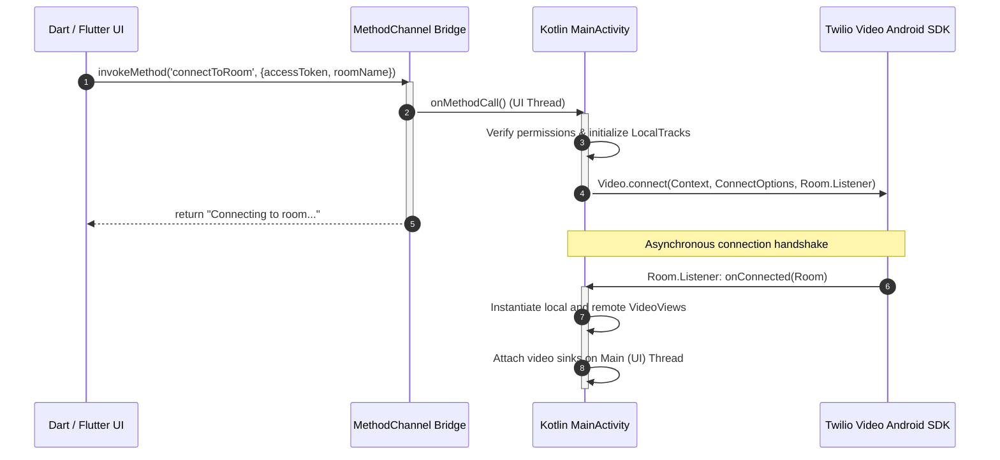

# Native-Dart Bridge: Platform Channel Design

This document details the architectural design and implementation of the real-time communication (RTC) bridge between the Flutter/Dart application layer and the native Android SDK using **Method Channels**.

---

## 1. Architectural Overview

The communication between Dart (Flutter) and Kotlin (Android) is facilitated via a bi-directional, asynchronous message-passing bridge. Due to the real-time nature of video streaming, synchronization between the Dart UI layer and the native Twilio SDK requires high throughput, minimal serialization overhead, and robust thread safety.



---

## 2. Platform Channel Protocol & API Contract

The project utilizes a single primary Method Channel to coordinate the video call lifecycle:
`com.example.twilio_poc/video`

### Method Signatures & Payload Schema

| Method Name | Direction | Payload (Dart ➔ Native) | Return Value (Native ➔ Dart) | Intent |
| :--- | :--- | :--- | :--- | :--- |
| `checkPermissions` | Dart ➔ Native | `void` | `bool` | Queries native permission states (`CAMERA`, `RECORD_AUDIO`, `BLUETOOTH_CONNECT`, `POST_NOTIFICATIONS`). |
| `requestPermissions` | Dart ➔ Native | `void` | `bool` | Triggers the Android runtime permission request flow. |
| `connectToRoom` | Dart ➔ Native | `{ "accessToken": String, "roomName": String }` | `String` (Connection Status message) | Instantiates local media tracks and triggers connection to Twilio rooms. |
| `disconnectFromRoom` | Dart ➔ Native | `void` | `String` (Success message) | Releases active media captures, detaches sinks, and terminates the session. |
| `toggleVideo` | Dart ➔ Native | `{ "enabled": bool }` | `String` (Status message) | Programmatically mutes/unmutes the local video track. |
| `toggleAudio` | Dart ➔ Native | `{ "enabled": bool }` | `String` (Status message) | Programmatically mutes/unmutes the local audio track. |
| `switchCamera` | Dart ➔ Native | `void` | `String` (Success message) | Hot-swaps the camera sensor (front ↔ back) mid-stream. |

---

## 3. Serialization and Message Passing

Flutter’s platform channels use standard message codecs to serialize and deserialize data. The data types mapped across the boundary are standard:

- Dart `Map` ➔ Kotlin `Map<*, *>`
- Dart `String` ➔ Kotlin `String`
- Dart `bool` ➔ Kotlin `Boolean`

### Serialization Cost & Overhead Considerations

Method Channel invocations are serialized into binary formats (using `StandardMessageCodec`) and copied across the native-Dart boundary. 
- **Latency Penalty:** Each round-trip across the platform channel incurs a small overhead (~1–3ms).
- **Optimization:** We do **not** stream high-frequency data (like video frames or audio packets) over the platform channel. Video frames remain strictly inside native memory (Kotlin and Twilio SDK C++ core) and are rendered directly inside `PlatformViews`. The channel is purely a **control plane**.

---

## 4. Threading Architecture and Concurrency

A core challenge of native integration is matching the single-threaded asynchronous nature of Dart with the multi-threaded concurrent execution of Android.

```
+---------------------------------------+      +---------------------------------------+
|              DART ISOLATE             |      |             ANDROID PROCESS           |
|                                       |      |                                       |
|  +---------------------------------+  |      |  +---------------------------------+  |
|  |       Dart Event Loop           |  |      |  |         Android UI Thread       |  |
|  |  (Single Thread, Asynchronous)   |  |      |  |    (Handles MethodChannel, UI)  |  |
|  +----------------+----------------+  |      |  +----------------+----------------+  |
|                   |                   |      |                   |                   |
|                   v                   |      |                   v                   |
|      [Platform Channel Boundary]  <---+------+--->   [Twilio SDK Worker Threads]     |
|                                       |      |  - Network Socket Polling             |
|                                       |      |  - WebRTC Media Processing            |
|                                       |      |  - Hardware Decoder Pipelines         |
+---------------------------------------+      +---------------------------------------+
```

### Threading Rules of the Bridge
1. **Dart Event Loop Execution:** All Dart code executes inside the main isolate. It handles UI rendering, Dart event propagation, and triggers Method Channel calls.
2. **Android UI Thread Dispatch:** Kotlin's `MethodChannel` invocations are strictly dispatched on the Android **UI Thread** (also known as the main thread).
3. **Offloading Native RTC Work:** The Twilio Video SDK spawns its own internal background worker and network threads to handle WebRTC sockets, packet parsing, and hardware hardware video decoding.
4. **Main-Thread Synchronization for Rendering:** Android `VideoView` components must be mutated (attached, detached, resized) on the **Main Thread**. When Twilio background listeners emit connection changes (`onConnected`, `onVideoTrackSubscribed`), Kotlin must use `runOnUiThread { ... }` or dispatchers to bridge the event safely back to the UI thread before interacting with Platform Views.

---

## 5. Lifecycle Synchronization and State Management

Native RTC sessions must be carefully bound to the Flutter application lifecycle to prevent major bugs such as:
- **Zombie Streams:** Video sensors or audio hardware continuing to capture media after the screen is closed.
- **Null Pointer Exceptions:** Background WebRTC threads attempting to render to a discarded surface.
- **Resource Leaks:** Memory leak of `LocalVideoTrack` or `Camera2Capturer` holding context references.

### State Synchronization Flow

- **App Initialization:** The `WidgetsFlutterBinding` guarantees that Method Channels are bound before any page rendering starts.
- **Connection Handshake:**
  - Dart transitions to `_isConnecting = true`.
  - Method Channel invokes native `connectToRoom`.
  - Android initializes camera capture, hooks it into the local layout, and registers listeners.
- **Disposal/Termination:**
  - When the user taps "End Call" or leaves the widget tree, Dart triggers `disconnectFromRoom` synchronously.
  - Native layer performs cleanup in a strict sequence:
    1. Removes local/remote `VideoView` sinks.
    2. Disconnects from `Room`.
    3. Releases `LocalAudioTrack` and `LocalVideoTrack` hardware descriptors.
    4. Sets references to null to allow Garbage Collection (GC) to reclaim memory.
