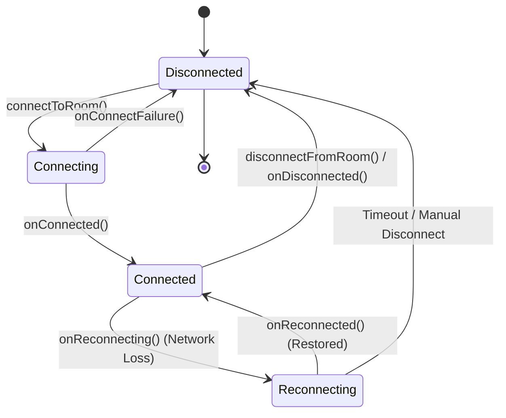
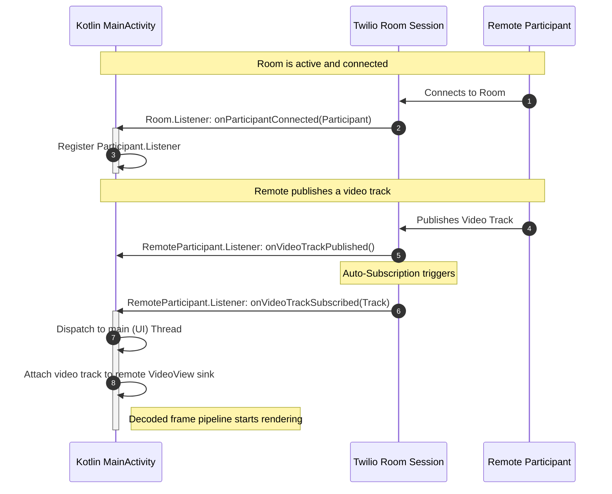

# RTC Lifecycle and Event Flow

This document details the architectural lifecycle and event-driven state machine that powers the real-time communication (RTC) layer in this application. It provides an in-depth breakdown of connection state transitions, remote participant discovery, media track subscription, and network re-negotiation.

---

## 1. RTC State Machine and Lifecycle

A real-time call is inherently dynamic and unstable. Network conditions fluctuate, users disconnect, hardware gets interrupted, and streams are published/unpublished asynchronously. To handle this complexity, the native Twilio SDK manages a strict state machine.



### Connection State Transitions

- **Disconnected:** Default state. No native WebRTC engine is running. Microphone and camera devices are unallocated.
- **Connecting:** Triggered by `connectToRoom`. A native connection worker is spawned. Hardware captures are bound to `LocalTracks`. Signaling sockets negotiate an SDP handshake with Twilio’s servers.
- **Connected:** Handshake complete. The user has joined the room session. Local tracks are published, and remote participant metadata is ingested.
- **Reconnecting:** Signaling or media socket drops. The SDK attempts background ICE restarts and network renegotiation without dropping the visual session.
- **Disconnected (Terminal):** Sockets closed, memory registers are cleared, media tracks are destroyed, and hardware is freed.

---

## 2. Remote Participant Discovery & Media Subscription

In real-time multi-party video conferencing, discovering a participant is separated from receiving their audio and video. Twilio models this separation using the concepts of **Publication** and **Subscription**.



### Flow Breakdown:
1. **Participant Registration (`onParticipantConnected`):** The room triggers this listener. The native controller registers a custom `RemoteParticipant.Listener` to monitor this specific participant's publications.
2. **Track Publication (`onVideoTrackPublished`):** The remote participant indicates they have activated their camera. At this stage, the raw media bytes are not yet received; only the metadata exists on the signal plane.
3. **Track Subscription (`onVideoTrackSubscribed`):** Since `enableAutomaticSubscription(true)` is activated in our configurations, our WebRTC client negotiates a down-stream stream connection. Once successfully negotiated, the track is fully subscribed, providing access to the raw media stream.
4. **Sink Attaching:** The active track is bound directly to the registered `VideoView` component. 

---

## 3. Asynchronous Threading and Thread Boundaries

All WebRTC events, socket signaling, and decoders run on background threads managed by Twilio's C++ core. When these threads emit status events, they are **not** on the UI Thread. Direct modification of visual UI components from these background threads will instantly crash the Android application.

### Safely Traversing Thread Boundaries in Kotlin:

Every track subscription or removal listener must safely bridge back to the Android Main Thread. The implementation implements this pattern explicitly:

```kotlin
private fun addRemoteVideoTrack(videoTrack: RemoteVideoTrack) {
    runOnUiThread {
        remoteVideoView?.let { view ->
            videoTrack.addSink(view)
            Log.d(TAG, "🎥 Remote video track attached to view")
        }
    }
}
```

By passing a lambda to `runOnUiThread`, we queue the graphical assignment of the video track onto Android’s main message loop, keeping UI manipulation strictly thread-safe.

---

## 4. Track Muting and Sensor Swapping

Real-time interaction requires the user to control their hardware inputs dynamically. This is implemented via control messages traversing the platform bridge to toggle native media track states.

### Media Track Control Methods:
- **Audio Track Muting (`toggleAudio`):**
  When Dart calls `toggleAudio(enabled: false)`, the native layer invokes `localAudioTrack?.enable(false)`. This instructs the native WebRTC engine to send "silent frames" over the audio socket, rather than tearing down the microphone device. This guarantees immediate, click-free muting and unmuting.
- **Video Track Toggling (`toggleVideo`):**
  Similar to audio, calling `localVideoTrack?.enable(false)` halts native video frame capture. The track remains connected, and the remote participant receives a black screen/pause event, rather than a track teardown.
- **Camera Hot-Swapping (`switchCamera`):**
  Rather than destroying the existing `LocalVideoTrack` and recreating it—which would force an SDP renegotiation and disrupt the call for 2-3 seconds—the codebase performs a zero-interruption hot-swap:
  ```kotlin
  val cameraCapturer = localVideoTrack?.videoCapturer as? Camera2Capturer
  cameraCapturer?.switchCamera(newCameraId)
  ```
  The native `Camera2Capturer` closes the current camera sensor (e.g., front) and opens the new camera sensor (e.g., back) dynamically, feeding the new frames directly into the active `LocalVideoTrack`. The stream remains uninterrupted, providing a premium, seamless user experience.
